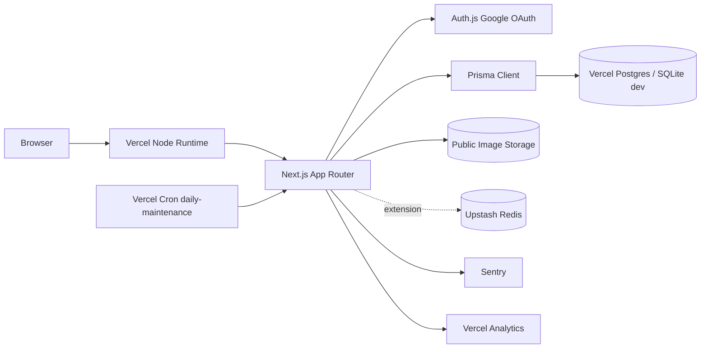
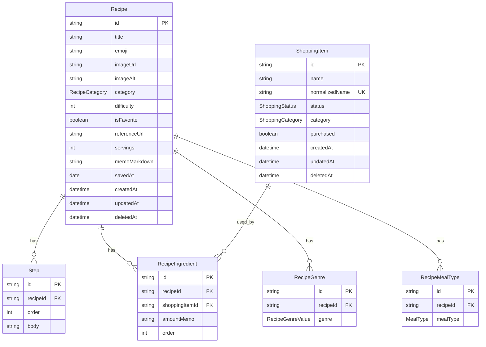
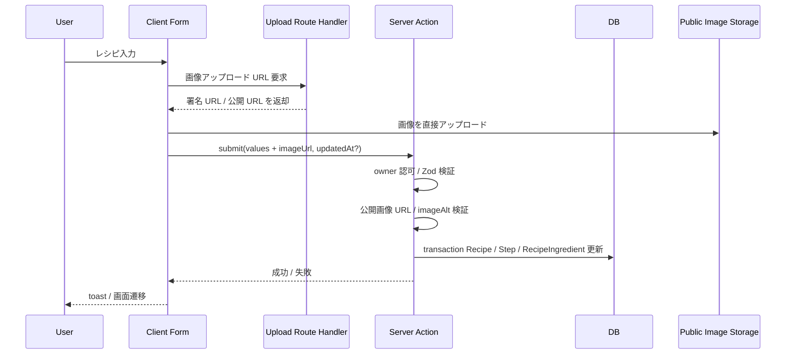
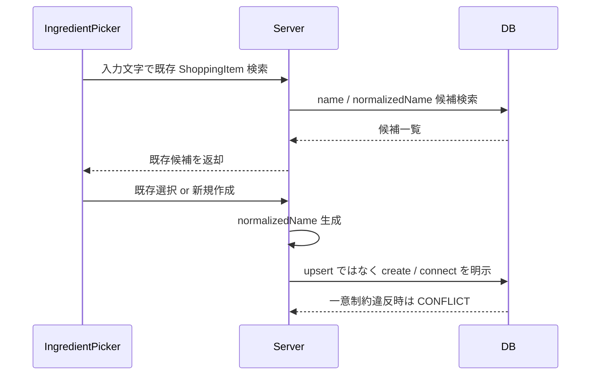
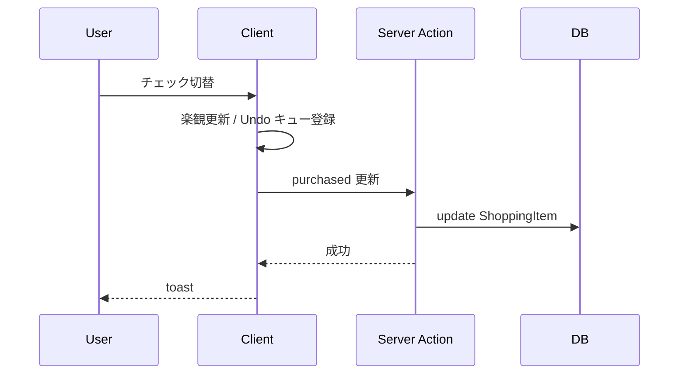
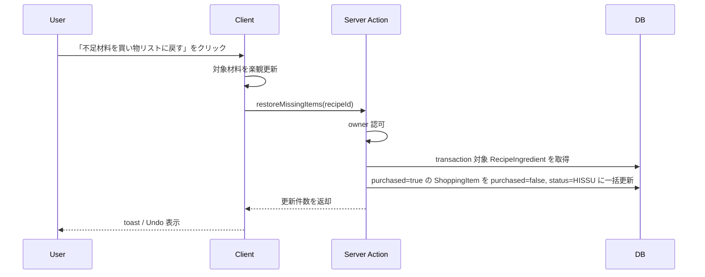

# MyKitchen システムアーキテクチャ設計書

本書は `requirement.md` を Web アプリとして実装するためのシステム構成、責務分離、データ設計、主要フローを定義する。

---

## 1. アーキテクチャ方針

| 方針 | 内容 |
|------|------|
| アプリ形態 | Next.js App Router によるサーバー中心の Web アプリ |
| 利用者モデル | 公開閲覧は全員可、書込は単一オーナーのみ |
| 実装優先度 | MVP は Vercel Hobby プランで運用できる範囲に収める |
| 状態管理 | 永続データは DB、共有可能な画面状態は URL、個人設定は `localStorage` |
| データ整合性 | Prisma のトランザクションと DB 制約で担保 |
| UI 方針 | モバイルファースト、Server Components を基本に必要箇所のみ Client Components |
| MVP 境界 | AuditLog、レート制限、自動バックアップ、動的 OGP 画像生成は【拡張】扱い。MVP のスキーマ・フローには組み込まない |
| Cron 方針 | Vercel Hobby の制約に合わせ、MVP の Cron は日次 1 ジョブに統合する |

---

## 2. 全体構成



### コンポーネント責務

| コンポーネント | 責務 |
|----------------|------|
| Browser | 画面表示、フォーム入力、一時状態、楽観更新、Undo キュー。PWA は【拡張】 |
| Next.js App Router | ルーティング、SSR/RSC、Server Actions、Route Handlers、SEO メタデータ生成 |
| Auth.js | Google OAuth、セッション発行、オーナー判定 |
| Prisma | DB アクセス、トランザクション、型安全なクエリ |
| Vercel Postgres | 本番データ永続化 |
| SQLite | ローカル開発用 DB |
| Public Image Storage | 料理写真の公開 URL 配信 |
| Upstash Redis | 【拡張】書込系 API のレート制限 |
| Vercel Cron | 日次 1 ジョブでソフトデリート物理削除を実行。自動バックアップは【拡張】として同じジョブに後続処理を追加 |
| Sentry | エラー監視 |
| Vercel Analytics | Web Vitals 収集 |

---

## 3. 技術スタック

| 区分 | 採用技術 | 用途 |
|------|----------|------|
| フレームワーク | Next.js App Router | Web アプリ本体、SSR、RSC、Route Handlers |
| 言語 | TypeScript | 型安全な実装 |
| UI | React, Tailwind CSS | 画面実装 |
| フォーム | React Hook Form + Zod | クライアント・サーバー共通バリデーション |
| DB ORM | Prisma | DB スキーマ管理、クエリ |
| 認証 | Auth.js Google Provider | 単一オーナー書込認証 |
| セッション | Auth.js JWT session | HttpOnly、SameSite=Lax、Secure Cookie |
| テーマ | next-themes | `light` / `dark` / `system` |
| i18n | `locales/ja.json` + `useTranslation()` | 日本語文言の集約、将来の英語追加に備える |
| DnD | dnd-kit | 手順並べ替え |
| Markdown | react-markdown | メモ表示 |
| 検索 UI | cmdk | グローバル検索パレット |
| ログ | pino | structured logging |
| 監視 | Sentry, Vercel Analytics | エラー通知、Web Vitals |
| テスト | Vitest, Testing Library, Playwright, axe | 単体・コンポーネント・E2E・a11y |

---

## 4. アプリケーション層

### レイヤー構成

```text
app/
  (public)        公開閲覧ページ
  (owner)         認証必須の作成・編集ページ
  api/            エクスポート、Cron、外部連携、動的 OGP（拡張）
  sitemap.ts      公開レシピ詳細を含む sitemap.xml 生成
  robots.ts       robots.txt 生成
components/
  ui/             汎用 UI
  recipe/         レシピ固有 UI
  shopping/       買い物リスト固有 UI
features/
  recipes/        レシピ use case、schema、query
  shopping/       ShoppingItem use case、schema、query
  auth/           owner 判定、認可ヘルパー
  export/         JSON export/import
lib/
  prisma.ts       Prisma Client
  result.ts       ApiResult / ErrorCode
  logger.ts       pino logger
  normalize.ts    ShoppingItem 正規化
prisma/
  schema.prisma
```

### 依存方向

```text
app -> components -> features -> lib -> prisma
```

UI から Prisma を直接呼ばず、`features/*` の use case を経由する。これにより、正規化名の一意制約、楽観ロック、ソフトデリートなどの業務ルールを一箇所に寄せる。AuditLog は【拡張】で追加する横断処理とし、MVP の use case には必須依存させない。

### 状態管理詳細

| 状態 | 保存先 | 実装 |
|------|--------|------|
| 検索・フィルター・ソート・ビュー | URL クエリ | Server Components の検索条件として読む |
| テーマ | `localStorage` | `next-themes` |
| データベースビューの列幅 | `localStorage` | `mykitchen:recipes-table:column-widths:v1` のように画面単位・バージョン付きキーで保存 |
| 最後に開いたタブ | `localStorage` | `mykitchen:shopping:last-tab:v1` |
| Undo キュー・モーダル開閉・ドラッグ中状態 | React state | セッション内だけ有効。永続化しない |

### URL クエリ規約

| パラメータ | 形式 | 意味 |
|------------|------|------|
| `q` | string | レシピ名・メモ本文の部分一致検索語 |
| `category` | enum | カテゴリー単一選択 |
| `genre` | repeated enum | `genre=肉料理&genre=時短` のように複数指定。複数時は AND 条件 |
| `mealType` | repeated enum | `mealType=夕食&mealType=夜食` のように複数指定。複数時は AND 条件 |
| `difficultyMin` / `difficultyMax` | int | 難易度範囲 |
| `favorite` | `true` | お気に入りのみ |
| `sort` | `savedAt` / `difficulty` / `title` | ソート対象 |
| `order` | `asc` / `desc` | ソート方向 |
| `view` | `gallery` / `table` | 一覧ビュー。お気に入りビューは `view=gallery&favorite=true` で表現する |
| `tab` | `active` / `purchased` | 買い物リストのタブ |

ジャンル・食事タイプの複数 AND は中間テーブルに対する「指定値ごとに存在する」条件として実装する。Prisma では `every` の空集合問題を避け、指定値ごとの `some` 条件または `GROUP BY ... HAVING count(distinct ...)` 相当のクエリに寄せる。

---

## 5. ルーティング設計

| ルート | 公開 | スコープ | 内容 |
|--------|------|---------|------|
| `/` | 可 | 【コア】 | ダッシュボード。最新レシピ、未購入 Top 10 |
| `/recipes` | 可 | 【コア】 | レシピ一覧。検索・フィルター・ビュー切替 |
| `/recipes/[id]` | 可 | 【コア】 | レシピ詳細フルページ |
| `/recipes/new` | 認証必須 | 【コア】 | 新規レシピ作成 |
| `/recipes/[id]/edit` | 認証必須 | 【コア】 | レシピ編集 |
| `/shopping` | 認証必須 | 【コア】 | 買い物リスト管理 |
| `/api/export` | 認証必須 | 【コア】 | JSON エクスポート |
| `/api/upload/recipe-image` | 認証必須 | 【コア】 | 料理写真アップロード用の署名 URL / 公開 URL を発行。Route Handler 入口で `requireOwner()` を必ず呼ぶ |
| `/api/cron/daily-maintenance` | Cron Secret 必須 | 【コア】 | 30 日超のソフトデリート物理削除。自動バックアップは【拡張】で同一ハンドラの後続処理として追加 |
| `/api/og/[recipeId]` | 可 | 【拡張】 | 動的 OGP 画像生成 |

一覧から詳細を開く場合は Intercepting Routes でモーダル表示し、URL 直打ちは通常の詳細ページとして表示する。ソフトデリート済み `Recipe` の `/recipes/[id]` は公開閲覧から完全に隠すため `notFound()` を返し、モーダル表示時も同じ扱いにする。

---

## 6. データモデル

### 主要テーブル



### DB 制約

| 対象 | 制約 |
|------|------|
| `ShoppingItem.normalizedName` | 一意制約。MVP では同一正規化名の新規作成不可 |
| `RecipeIngredient` | `recipeId`、`shoppingItemId`、`order` を必須化。同一材料を下味・仕上げなどで複数回使えるよう、`recipeId, shoppingItemId` の一意制約は置かない |
| `RecipeGenre(recipeId, genre)` | 一意制約。同一レシピ内で同じジャンルを重複登録しない |
| `RecipeMealType(recipeId, mealType)` | 一意制約。同一レシピ内で同じ食事タイプを重複登録しない |
| `Step(recipeId, order)` | 一意制約。手順順序を安定化 |
| `Recipe.deletedAt` | `NULL` のみ通常一覧・検索対象 |
| `ShoppingItem.deletedAt` | `NULL` のみ通常一覧・候補検索対象。孤立項目の手動削除もソフトデリートで扱う |
| 関連テーブル削除 | `Step`、`RecipeIngredient`、`RecipeGenre`、`RecipeMealType` は `Recipe` に対して `onDelete: Cascade` を設定し、Recipe 物理削除時に連鎖削除する |
| enum 項目 | `RecipeCategory`、`RecipeGenreValue`、`MealType`、`ShoppingStatus`、`ShoppingCategory` は Prisma enum で定義する |
| 範囲・文字数 | `title` 1-80 字、`difficulty` 1-5、`servings` 1-20、`ShoppingItem.name` 1-40 字は Zod と DB CHECK 制約の両方で検証する |

Prisma enum は SQLite / PostgreSQL の両方で扱える形に寄せ、DB CHECK 制約は provider 差分を migration で吸収する。直接 SQL で不正値が入ることを防ぐため、アプリケーション層の Zod だけには依存しない。

### ShoppingItem 削除方針

`ShoppingItem` は複数レシピで再利用されるため、MVP では自動削除しない。孤立した `ShoppingItem` をオーナーが手動削除する場合も `deletedAt` を設定するソフトデリートとし、ハード削除 UI は提供しない。日次メンテナンスでは、`deletedAt` が 30 日を超え、かつ `RecipeIngredient` が残っていない項目のみ物理削除の対象にする。

孤立判定では、ソフトデリート中の `Recipe` に紐づく `RecipeIngredient` も「まだ使用中」と扱う。Recipe が物理削除され、`onDelete: Cascade` によって関連 `RecipeIngredient` が消えた後で初めて、その `ShoppingItem` は孤立候補になる。

### ShoppingItem 正規化

`normalizedName` は保存前に必ずサーバーで生成する。

処理方針:

1. 前後空白を削除する
2. Unicode 正規化 `NFKC` を適用し、全角・半角差をできるだけ吸収する
3. 英数字を小文字化する
4. 連続空白を 1 つに寄せる

クライアント側でも候補表示のため同じ正規化処理を使ってよいが、最終判定は必ずサーバーと DB 制約で行う。

---

## 7. 主要フロー

### レシピ作成・編集



編集時は hidden field の `updatedAt` と DB の現行値を比較し、不一致なら `409 CONFLICT` 相当の結果を返す。

Step の並べ替えは `order` を 10, 20, 30 のように間隔付き整数で管理し、通常の挿入・移動では中間値を採番する。全体再採番が必要な場合は、同一トランザクション内で一度負値に退避してから正の連番に戻し、`Step(recipeId, order)` の一意制約と衝突しないようにする。

### 材料追加



既存候補の再利用を優先するため、UI は新規作成ボタンより候補選択を先に表示する。

### 購入済みトグル



失敗時はクライアントでロールバックし、エラートーストを表示する。Undo は `purchased` の再更新として扱う。

### 不足材料を買い物リストに戻す



Undo は対象 `ShoppingItem` の変更前状態をクライアントキューに保持し、5 秒以内に押された場合のみ一括で元に戻す。サーバー側は一括更新を 1 トランザクションで行い、部分成功を作らない。

### キーボードショートカット

グローバル KeyHandler は `app` 配下の root layout から読み込む Client Component に集約する。`⌘K` / `Ctrl+K` は `cmdk` のコマンドパレットを開き、`⌘N` は認証済みなら `/recipes/new` へ遷移する。`Esc` とフォーカストラップはモーダル基盤コンポーネントで扱い、フォーム入力中のショートカット誤発火を避ける。

`/` キーはグローバルには奪わず、サイドバーにフォーカスがある時だけフィルター入力欄へフォーカスする。ブラウザのページ内検索と衝突しないよう、入力欄・テキストエリア・contenteditable 上では無効化する。

### フォームと表示の UX 規約

| 項目 | 実装方針 |
|------|----------|
| ルートエラー | 主要ルートごとに `error.tsx` を置き、ユーザー向けメッセージと再試行ボタンを表示する。再試行は `reset()` または再取得 action に寄せる |
| ローディング | App Router の Suspense 境界と `loading.tsx` を使い、一覧・詳細・買い物リストにスケルトン UI を表示する |
| 未保存警告 | 新規作成・編集フォームは dirty state を持ち、未保存変更がある場合のみ `beforeunload` とアプリ内遷移ガードで確認する |
| フォーカス | モーダルはフォーカストラップ、閉じた後は起点要素にフォーカスを戻す |

---

## 8. 認証・認可

### 認証

Auth.js の Google Provider を利用し、サインイン時に Google profile の `email` と `email_verified = true` を確認し、`OWNER_GOOGLE_EMAILS` の許可リストと比較する。一致しないユーザー、または未検証メールのユーザーにはセッションを発行しない。`OWNER_GOOGLE_EMAILS` はカンマ区切りで 2 件以上を設定でき、MVP では単一人物のオーナー本人アドレスと予備アドレスの 2 件を想定する。これは共同編集者リストではない。

Auth.js は v5 系を前提にし、セッション戦略は JWT とする。セッション Cookie は HttpOnly、SameSite=Lax、Secure を必須にし、Server Actions と Route Handlers では `auth()` を経由して `requireOwner()` を判定する。

必要な環境変数は `AUTH_SECRET`、`GOOGLE_CLIENT_ID`、`GOOGLE_CLIENT_SECRET`、`OWNER_GOOGLE_EMAILS` とする。

### 認可

| 操作 | 認可 |
|------|------|
| レシピ閲覧 | 不要 |
| レシピ一覧・検索 | 不要 |
| SEO メタデータ / 固定 `og:image` | 不要 |
| 動的 OGP 画像 | 不要（【拡張】） |
| レシピ作成・編集・削除 | オーナー必須 |
| ShoppingItem 作成・編集・削除 | オーナー必須 |
| エクスポート・インポート | オーナー必須 |
| Cron | `CRON_SECRET` 必須 |

Server Actions と Route Handlers の入口で `requireOwner()` を呼び出し、UI 側の表示制御だけに依存しない。

CSRF は Server Actions の組込保護と Auth.js の CSRF トークンに依拠する。MVP では独自 CSRF 実装を追加しない。

---

## 9. 画像設計

料理写真は公開閲覧ページ・一覧サムネイル・OGP で共通利用するため、公開 URL で配信できる画像のみ扱う。

| 項目 | 方針 |
|------|------|
| 保存先 | Vercel Blob など公開 URL を返せるストレージ |
| DB 保存値 | `imageUrl`, `imageAlt` |
| アップロード権限 | オーナーのみ |
| アップロード方式 | クライアント直送 + 署名 URL 発行 Route Handler を第一候補とする。Server Action で画像バイナリを中継しない |
| ファイル制限 | JPG / PNG / WebP、最大 5MB |
| 代替テキスト | `imageUrl` がある場合、`imageAlt` はフォーム Zod 上必須。未入力時は保存前に警告する |
| 配信 | `next/image` で最適化 |
| 禁止 | 秘匿画像、認証必須画像、期限付き URL 前提の画像 |

画像削除は MVP ではレシピ削除と同期せず、将来のクリーンアップ対象とする。これにより Undo とソフトデリートの整合性を優先する。

---

## 10. Markdown 表示方針

`memoMarkdown` は公開レシピ詳細に表示されるため、XSS 対策を優先する。`react-markdown` は HTML 無効化のまま使い、`rehype-raw` は採用しない。将来 HTML を許可する必要が出た場合のみ、`rehype-sanitize` と許可タグリストを明示してから導入する。

---

## 11. API / Server Actions 方針

| 用途 | 実装 |
|------|------|
| フォーム送信 | Server Actions |
| 購入済み・お気に入りトグル | Server Actions |
| 画像アップロード署名 URL 発行 | `/api/upload/recipe-image` Route Handler |
| 動的 OGP 画像 | 【拡張】Route Handler |
| JSON エクスポート | Route Handler |
| Cron | `/api/cron/daily-maintenance` Route Handler |
| 外部から呼ぶ可能性がある処理 | Route Handler |

すべてのレスポンスは `ApiResult<T>` 互換の形に寄せる。Server Actions でも例外を直接 UI に漏らさず、`ErrorCode` とユーザー向けメッセージに変換する。

---

## 12. キャッシュ・再検証

| 対象 | 方針 |
|------|------|
| 公開レシピ詳細 | DB 読取。更新後に `revalidatePath('/recipes/[id]')` 相当で再検証 |
| レシピ一覧 | 検索条件が URL に乗るためサーバーで都度検索 |
| ダッシュボード | 更新後に `/` を再検証 |
| SEO / `og:image` | 料理写真があればその `imageUrl`、なければリポジトリ同梱の `/og-default.png` を設定する。`/api/og/[recipeId]` による動的生成は【拡張】 |
| 認証必須ページ | 動的レンダリング |

MVP では複雑な CDN キャッシュ制御より、データの新しさと実装単純性を優先する。

OGP の固定フォールバック画像は 1200x630 を推奨サイズとする。料理写真は任意比率・最大 5MB のため、OGP 上のトリミング差は MVP では受容し、動的 OGP 画像生成【拡張】で解消する。

レシピ詳細で参照する `ShoppingItem` がソフトデリート済みの場合、材料名は表示し、オーナー閲覧時のみ「削除済み」注記を付ける。公開閲覧では不要な管理状態を出さず、材料名と分量メモだけを表示する。

### 検索方針

部分一致検索はレシピ名・メモ本文を対象にする。本番 PostgreSQL では Prisma `contains` と `mode: 'insensitive'` を使い、ローカル SQLite では検索対象と検索語を `LOWER()` 相当に正規化した比較に寄せる。dev / 本番で大文字小文字の挙動が割れないよう、検索 use case の単体テストで同じ期待値を固定する。

---

## 13. エラー処理・ログ

### ErrorCode

| Code | 意味 |
|------|------|
| `VALIDATION_ERROR` | 入力不正 |
| `UNAUTHORIZED` | 未認証 |
| `FORBIDDEN` | オーナーではない |
| `NOT_FOUND` | 対象なし |
| `CONFLICT` | 楽観ロック不一致、正規化名重複 |
| `RATE_LIMITED` | 【拡張】レート制限 |
| `INTERNAL` | 予期しないエラー |

### ログ方針

- リクエスト ID を生成し、レスポンスとログに含める
- 書込系の業務監査は【拡張】の `AuditLog` として追加する。MVP ではシステムログとリクエスト ID に留める
- システムエラーは `pino` で構造化ログに出し、Sentry に通知する
- ユーザー向けエラー文には内部例外や SQL 詳細を含めない

---

## 14. バックアップ・メンテナンス

| 処理 | 実行方法 | 内容 |
|------|----------|------|
| JSON エクスポート | 認証必須 UI / API | レシピ、ShoppingItem、RecipeIngredient、画像 URL を出力 |
| 日次メンテナンス | Vercel Cron 日次 1 ジョブ | `deletedAt < now() - 30 days` の Recipe / ShoppingItem を物理削除 |
| 自動バックアップ | 【拡張】Vercel Cron 日次 1 ジョブ内の後続処理 | 日次メンテナンスの物理削除後に、エクスポート JSON を Blob に保存し 30 日世代管理 |
| Notion 取込 | CLI script | CSV / Markdown を Prisma 経由で投入 |

Cron は Hobby プランの制限に合わせ、`/api/cron/daily-maintenance` の 1 本に統合する。自動バックアップを拡張で有効化する場合も別 Route Handler は増やさず、同じジョブ内で物理削除の後に順次実行する。

日次メンテナンスは Recipe の物理削除、`onDelete: Cascade` による関連テーブル削除、ShoppingItem の孤立判定、ShoppingItem の物理削除の順に実行する。ShoppingItem の孤立判定は、物理削除済み Recipe の関連を除外した後の `RecipeIngredient` 有無で判断する。

JSON エクスポートは MVP の想定件数では 10 秒以内に完了する前提で実装する。件数増加で Vercel Hobby の実行時間制約に近づく場合は、streaming response、ページングされた分割エクスポート、またはバックグラウンド生成に切り替える。

---

## 15. テスト戦略

| レベル | 対象 |
|--------|------|
| Unit | `normalizeShoppingItemName`, 検索正規化、Zod schema、use case |
| Component | RecipeCard, IngredientPicker, ShoppingListTable |
| Integration | Server Actions、Prisma transaction、認可 |
| E2E | `/`, `/recipes`, `/recipes/[id]`, `/shopping` |
| a11y | Playwright + `@axe-core/playwright` で主要 4 ページ violations=0 |

特に `ShoppingItem.normalizedName` の重複防止は、単体テストと DB 一意制約の統合テストの両方で確認する。

---

## 16. MVP 実装順序

1. Next.js / Prisma / Auth.js の土台構築
2. Recipe / Step / ShoppingItem / RecipeIngredient の DB スキーマ作成
3. 公開レシピ一覧・詳細の読取実装
4. Google OAuth によるオーナー認証
5. レシピ作成・編集・ソフトデリート
6. IngredientPicker と ShoppingItem 正規化名重複防止
7. 買い物リスト、購入済みトグル、Undo
8. 画像アップロードと公開 URL 配信
9. SEO メタデータ、固定 `og:image`、エクスポート
10. 日次メンテナンス Cron
11. Playwright / axe / Lighthouse を含む品質確認

---

## 17. 環境変数一覧

| 変数 | スコープ | 用途 |
|------|----------|------|
| `AUTH_SECRET` | 【コア】 | Auth.js の署名・暗号化 |
| `AUTH_URL` | 【コア】 | ローカル開発時の OAuth callback 解決。例: `http://localhost:3000` |
| `GOOGLE_CLIENT_ID` | 【コア】 | Google OAuth Client ID |
| `GOOGLE_CLIENT_SECRET` | 【コア】 | Google OAuth Client Secret |
| `OWNER_GOOGLE_EMAILS` | 【コア】 | 書込可能な Google アカウントのメールアドレス。カンマ区切りで 2 件以上指定可 |
| `DATABASE_URL` | 【コア】 | Prisma 接続先。開発 SQLite / 本番 Vercel Postgres を切替 |
| `CRON_SECRET` | 【コア】 | `/api/cron/daily-maintenance` の認可 |
| `BLOB_READ_WRITE_TOKEN` | 【コア】 | Vercel Blob など公開画像ストレージへの書込 |
| `NEXT_PUBLIC_APP_URL` | 【コア】 | OGP、sitemap、絶対 URL 生成 |
| `SENTRY_DSN` | 【コア】 | Sentry エラー通知 |
| `UPSTASH_REDIS_REST_URL` | 【拡張】 | レート制限 |
| `UPSTASH_REDIS_REST_TOKEN` | 【拡張】 | レート制限 |

---

## 18. 未決事項

| 項目 | 初期方針 |
|------|----------|
| 画像ストレージ | Vercel Blob を第一候補。実装時に無料枠と URL 永続性を確認 |
| 画像の孤児化 | MVP ではレシピ削除と画像削除を同期しない。将来、未参照画像クリーンアップを日次メンテナンスに追加する |
| PWA | 【拡張】MVP は通常のレスポンシブ Web アプリとして提供し、Web App Manifest / Service Worker / オフライン閲覧は後続で追加する |
| 本番 DB | Vercel Postgres を第一候補。Prisma の provider 切替を前提にする |
| 検索品質 | MVP は部分一致。件数増加後に全文検索を検討 |
| 動的 OGP 画像生成 | 【拡張】`/api/og/[recipeId]` と Next.js `ImageResponse` で追加する |
| AuditLog / レート制限 | 【拡張】MVP 完了後にテーブル・横断処理・Upstash Redis を追加する |
| バックアップ復元 UI | MVP 後の拡張。まずエクスポートを優先 |
